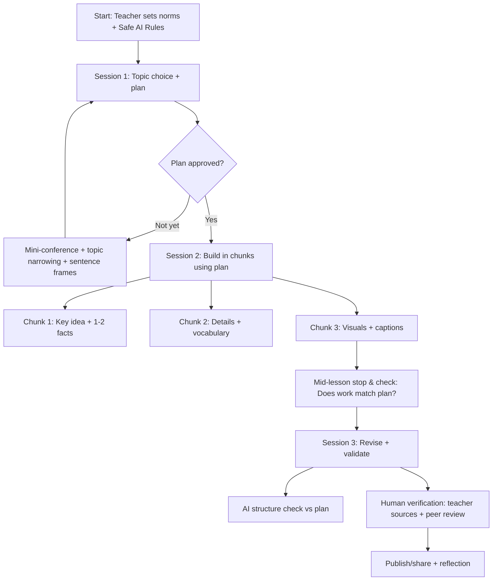
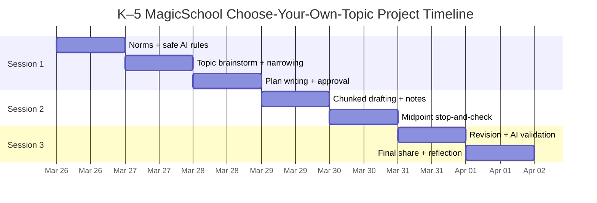

# Three-Session LaTeX Lesson on Using MagicSchool for a Choose-Your-Own-Topic AI Project in K–5

## Executive summary

This report synthesizes **primary internal references** from the two *teaching_placement* GitHub repositories (public + private) and **secondary, reputable external sources** to design a **three-session, K–5-ready lesson** (delivered as a complete LaTeX file) for teaching students to use **MagicSchool / MagicStudent** as a **guided, teacher-supervised AI tool** to complete a **choose-your-own-topic** learning product. The internal lesson packets emphasize predictable lesson “routines” (clear success criteria, explicit modeling, visible checklists, help routines, mid-lesson stop-and-check, and a final proof move) and foreground inclusive supports such as chunked directions and flexible entry points. fileciteturn13file0L1-L1

External findings add critical constraints and safeguards: MagicSchool’s **Student Data Policy (effective March 9, 2026)** states that student use is school/educator-enabled (via SSO or room code), student inputs are teacher-directed, and MagicSchool commits to limiting data use (no selling/targeted ads; no model training on student data; “zero data retention” with AI providers). citeturn19view0 These constraints pair naturally with federal and international guidance stressing **human-in-the-loop oversight**, safety, and age-appropriate governance for generative AI in education. citeturn7view0turn26view1

The lesson design therefore treats AI as a **thinking partner** rather than a replacement for student reasoning—aligned with MagicSchool’s public guidance that AI should “support thinking rather than doing the thinking,” and that teacher expectations should govern use like any other instructional resource. citeturn27view0 Students produce a tangible artifact (poster / mini-book / short slide deck), and Session 3 includes an explicit **AI validation pass** against the student’s plan and the project’s required structure—while also teaching that AI outputs can be wrong and must be checked. citeturn7view0turn27view0

## Repository-derived design principles and constraints

The *teaching_placement* repository’s lesson packets repeatedly use a planning spine that (a) makes expectations visible, (b) anticipates friction, and (c) captures “proof” of learning. A canonical example (MagicSchool lesson packet) frames supports like: **model the first screen/tool**, keep a **visible checklist**, use a **help routine**, anticipate that tool navigation can overshadow learning, and end with a short “proof” move (save/share/explain). fileciteturn13file0L1-L1 This same packet format appears across AI and digital citizenship lessons, suggesting a consistent, school-compatible way to package multi-session learning. fileciteturn18file0L1-L1

Across internal lessons, several high-leverage practices recur and are directly adapted into the three-session sequence:

First, inclusion is framed as a **design requirement**, not an add-on: lessons specify chunked steps, visual modeling, predictable routines, and flexible roles as an “inclusion focus.” fileciteturn12file0L1-L1 Second, the curriculum anticipates *real classroom friction*: navigation overload, typing load, and “decorating instead of finishing” are called out as failure modes, which is especially important when introducing AI tools that offer many options. fileciteturn13file0L1-L1 Third, prior AI-related lessons in the repo position AI as something students learn **with and about** (e.g., AI for Oceans: data/bias/classification; AI as a thought partner), reinforcing that students should practice evaluating outputs rather than accepting them uncritically. fileciteturn18file0L1-L1

The private repository includes a long workshop transcript used in placements; while the transcript is not a formal product spec, it functions as situational evidence that the placement context treats “responsible AI” as teachable routines (guardrails, teacher control, and classroom norms) rather than open-ended chatbot use. fileciteturn10file0L1-L1 In this report, those routines are operationalized into: **tool-limited student rooms, teacher-visible work, privacy rules, and structured prompts**.

## External research on MagicSchool, student safety, and AI-in-schools alignment

MagicSchool describes MagicStudent as “learning-first AI” for classrooms, emphasizing teacher oversight (“track student learning”) and “built-in moderation guided by district expectations.” citeturn17view0 Its FAQ states student interactions are stored for educator visibility and that content moderation is multi-layered with additional filters for K–12 contexts. citeturn27view0

From a privacy perspective, MagicSchool’s Student Data Policy (effective March 9, 2026) explicitly positions MagicSchool as a service provider/processor for schools, and highlights: student access is school/educator-enabled (SSO or room code), collection is minimized to what is necessary (including student inputs/academic content), and the company commits to not selling/sharing student data for non-educational purposes and not allowing LLM providers to retain or train on student data; it also asserts “zero data retention” with AI providers for student materials. citeturn19view0 This aligns with common K–5 implementation needs: adult supervision, minimized student accounts, and clear classroom constraints.

Broader governance guidance reinforces these design choices. The U.S. Department of Education’s OET report emphasizes that AI can introduce privacy risks, bias, and incorrect/inappropriate outputs and calls educational systems to govern AI use; it also foregrounds “human in the loop” approaches and equity-centered policy foundations. citeturn7view0 UNESCO likewise calls for human-centered and age-appropriate approaches and explicitly references setting an age limit for independent conversations with GenAI platforms—supporting the model of teacher-mediated student AI use. citeturn26view1

For pedagogy and digital citizenship, a common thread across reputable sources is that students need explicit instruction in responsible use, critical thinking, and human agency. ISTE’s Student Standards (Digital Citizen; Knowledge Constructor; Creative Communicator) provide a widely used lens for aligning technology use with agency and ethical participation. citeturn2search4 Common Sense Education’s AI-era materials emphasize human skills (creativity, agency, critical thinking) and explicitly connect modern digital literacy curriculum updates to a rapidly changing AI landscape. citeturn2search5turn10search3

Finally, inclusion is strengthened by a UDL framing: CAST describes UDL as a framework for optimizing teaching for all learners and organizes guidelines into Engagement, Representation, and Action & Expression—useful for designing multiple pathways to complete the same project (oral, visual, dictated, scaffolded writing). citeturn23view0

## Three-session lesson architecture with comparison tables and mermaid diagrams

### Choose-your-own-topic project definition

Students choose a topic they care about (examples: a favorite animal, a landmark, a sport, a community helper, a science phenomenon, an inventor, a book genre). They create a **short “Learning Showcase” product** in one of three formats:

A poster (paper or digital) with headings and visuals; a 3–5 slide mini-deck; or a mini-book (4–8 pages) with drawings and captions.

To minimize “tool navigation overshadowing content,” the teacher should preselect only a small set of MagicStudent tools (for example, Idea Generator + Informational Texts/Research Assistant + Writing Feedback), consistent with internal lesson warnings about overload and completion illusions. fileciteturn13file0L1-L1 citeturn18view0

### Session comparison table

| Session focus | Objectives | Core activities | MagicSchool/MagicStudent use | Materials | Assessment & evidence |
|---|---|---|---|---|---|
| Brainstorm and lock topic + plan | Students choose a topic, generate questions/subtopics, and build a plan with success criteria. | Topic “interest inventory,” topic narrowing, teacher modeling, plan template completion. | Use **Idea Generator** (or **AI Learning Assistant**) as a brainstorming partner; store teacher-visible plan. citeturn18view0turn27view0 | Planning template, anchor chart (“Safe AI Rules”), devices, curated topic bins (optional). | Teacher checks plan completeness; quick exit ticket (“My topic / my 3 questions / my next step”). |
| Learn and execute step-by-step using plan | Students draft content section-by-section, using plan as checklist and verifying key facts. | Work in “chunks” (Section 1 → 2 → 3), mid-lesson stop-and-check, partner read-back. | Use **Informational Texts** and/or **Research Assistant** for age-appropriate draft info; use Writing Feedback for clarity; emphasize “AI can be wrong—verify.” citeturn18view0turn7view0 | Devices, creation tool (slides/book/poster), teacher-provided sources (books/articles), note-catcher. | Observation checklist; collect 1 screenshot/photo of work-in-progress + 1 oral explanation. |
| Finalize + AI validation against plan and structure | Students revise for accuracy and structure; AI is used to validate against plan, not replace thinking. | Revision pass, “structure check,” peer feedback, final share. | Use **Writing Feedback** and/or a **Custom Chatbot** rubric-checker; run “compare my product to my plan” prompt; teacher confirms no personal info. citeturn18view0turn27view0turn19view0 | Rubric, reflection prompts, sharing method (gallery walk/mini-presentations). | Final product + reflection (“How AI helped / what I fixed / what I’m proud of”). |

### Mermaid lesson flow diagram



### Mermaid timeline diagram



## Rubric and inclusive practices for diverse learners

### Performance rubric tailored for K–5

This rubric is designed to work across K–5 by allowing multiple modalities (oral, visual, dictated text) while maintaining consistent criteria. It also explicitly assesses **responsible AI use**, reflecting both internal placement priorities (visible success criteria + proof) and external governance needs (privacy, oversight, accuracy). fileciteturn13file0L1-L1 citeturn19view0turn27view0

**Performance levels**

Beginning: needs support to start/complete; Developing: partial independence with reminders; Proficient: meets expectations independently; Extending: exceeds by deepening quality, clarity, or verification.

| Criteria | Beginning | Developing | Proficient | Extending |
|---|---|---|---|---|
| Topic focus and plan | Topic is unclear or changes repeatedly; plan missing key parts. | Topic chosen; plan has some parts but lacks questions/steps. | Topic is clear; plan lists questions/subtopics and steps; teacher can see next steps. | Topic is focused and meaningful; plan anticipates challenges and includes “how I will check facts.” |
| Responsible AI use and privacy | Uses AI without following rules; includes personal info or copies output directly. | Attempts safe use but needs reminders (privacy, copying, off-task prompts). | Uses AI as a helper (ideas/drafts), not a replacement; avoids personal info; teacher can see appropriate use. citeturn27view0turn19view0 | Uses AI strategically (asks better questions, requests simpler explanations) and documents how AI helped; models strong digital citizenship to peers. citeturn27view0turn2search4 |
| Content accuracy and evidence | Facts are unclear/unverified; misunderstandings remain. | Some correct information; limited verification. | Key facts are understandable and checked using teacher-approved sources or classroom discussion; student can explain in own words. citeturn7view0turn22view0 | Adds deeper detail and clearly distinguishes “I learned” from “AI suggested”; can explain how verification happened. citeturn7view0turn26view1 |
| Organization and product structure | Product lacks required parts (headings/sections). | Has some structure; missing sections or inconsistent ordering. | Product matches the plan’s structure (headings/sections) and is easy to follow. | Uses strong transitions, clear section titles, and a purposeful layout tailored to audience. |
| Communication and craftsmanship | Hard to read/hear; minimal labels/captions. | Communication is partially clear; needs editing support. | Clear communication for grade band (labels, captions, oral explanation); visuals support meaning. | Highly engaging and audience-aware (strong visuals, precise language, polished delivery). |
| Reflection and revision | Little revision; cannot describe what changed. | Revises with prompts; reflection is brief. | Revises based on feedback; can name at least one improvement made after checking against plan. citeturn27view0turn13file0L1-L1 | Uses AI validation + peer feedback to make multiple targeted improvements and can explain why changes matter. citeturn27view0turn7view0 |

### Inclusive strategies and practices

This lesson uses a UDL-aligned approach: options for engagement (topic choice), representation (visuals, read-aloud, simplified texts), and action/expression (poster, oral presentation, dictated writing). citeturn23view0 Internal placement lessons operationalize these principles through **visual modeling, chunked steps, role clarity, and flexible entry points**—all baked into the session routines and the plan template. fileciteturn13file0L1-L1

Key inclusive moves (implemented across all sessions) include partnered roles (“driver/coach” or “reader/recorder”), sentence frames for prompting and writing, optional voice typing, and “proof of learning” options beyond typing (oral explanation, labeled drawing, photo of poster with captions). These align with placement evidence that students benefit from predictable routines and that typing load can obscure conceptual understanding. fileciteturn13file0L1-L1

## Full LaTeX lesson file

```tex
\documentclass[11pt]{article}

% --- Core style mirrors teaching-placement lesson packets (article + simple packages)
\usepackage[utf8]{inputenc}
\usepackage[T1]{fontenc}
\usepackage[margin=1in]{geometry}
\usepackage{hyperref}
\usepackage{enumitem}

% --- Helpful formatting for a full multi-session lesson
\usepackage{booktabs}
\usepackage{tabularx}
\usepackage{longtable}
\usepackage{xcolor}
\usepackage{array}

\title{MagicSchool Choose-Your-Own-Topic Project (K--5)\\\large Three-Session Lesson Packet}
\author{(Adapted from teaching\_placement lesson packet conventions)}
\date{March 26, 2026}

% --- Small helpers
\newcommand{\Session}[1]{\section*{#1}}
\newcommand{\Sub}[1]{\subsection*{#1}}
\newcolumntype{Y}{>{\raggedright\arraybackslash}X}

\begin{document}
\maketitle

\Session{Quick Scan}
\begin{itemize}[leftmargin=*]
  \item Grades: K--5 (adaptations included for K--2 and 3--5)
  \item Sessions: 3 (45--60 minutes each; may be shortened to 30--40 for K--2)
  \item Core project: student chooses a topic and creates a small ``Learning Showcase'' product (poster / mini-book / short slide deck)
  \item AI platform: MagicSchool / MagicStudent (exact tool availability depends on school configuration)
  \item Key routine: Plan $\rightarrow$ Build in chunks $\rightarrow$ Validate and revise
\end{itemize}

\Session{School Planning Goals and Inclusion}
\begin{itemize}[leftmargin=*]
  \item \textbf{What is expected:}
  Students use AI as a learning helper (not a replacement), follow privacy rules, and produce an observable artifact that matches a plan.
  \item \textbf{Inclusion focus:}
  visual modeling, chunked steps, predictable routines, partner roles, flexible ways to show learning (oral, visual, typed, dictated).
  \item \textbf{Known friction points to guard against:}
  tool navigation overload, typing/spelling load, and ``decorating'' before meeting success criteria.
  \item \textbf{Teacher success criteria (visible in the room):}
  (1) Everyone has a topic + plan, (2) Everyone builds in chunks using the plan, (3) Everyone runs a final check and can explain what they did.
\end{itemize}

\Session{Digital Citizenship and Safe AI Rules (Post as an Anchor Chart)}
\begin{itemize}[leftmargin=*]
  \item \textbf{No personal information:} do not type full names, addresses, phone numbers, passwords, or private stories.
  \item \textbf{AI can be wrong:} check important facts using class sources or teacher help.
  \item \textbf{AI is a helper:} you still do the thinking and decide what to use.
  \item \textbf{Be kind and school-appropriate:} prompts must match classroom expectations.
  \item \textbf{Teacher visibility:} remind students that classroom AI work is monitored for safety and learning.
\end{itemize}

\Session{Session Overview Table}
\begin{center}
\begin{tabularx}{\textwidth}{@{}p{2.8cm}YYY@{}}
\toprule
\textbf{Session} & \textbf{Objectives} & \textbf{Activities} & \textbf{Assessment / Evidence} \\
\midrule
Session 1: Brainstorm + Plan &
Choose topic; generate 3--5 questions/subtopics; create a plan and success checklist. &
Mini-lesson + modeling; topic narrowing; complete plan template; teacher approval. &
Plan check (topic + questions + steps); exit ticket: ``My topic / my 3 questions / next step''. \\
\addlinespace
Session 2: Build in Chunks &
Draft section-by-section using plan; verify key facts; begin final product. &
Chunked work blocks (Section A/B/C); mid-lesson stop-and-check; partner read-back. &
Teacher observation checklist + 1 screenshot/photo of work-in-progress + oral explanation. \\
\addlinespace
Session 3: Revise + Validate &
Finalize product; use AI to check structure vs plan; revise and reflect. &
AI validation prompt; peer feedback; revise; share; reflect. &
Final product + reflection (how AI helped, what I fixed, what I learned). \\
\bottomrule
\end{tabularx}
\end{center}

% -------------------------
\Session{Session 1: Brainstorm and Lock Topic + High-Level Plan}
\Sub{Teacher materials}
Devices; projector; planning template (below); optional topic bins (books, pictures, short texts); sticky notes; timer.

\Sub{Timing (suggested 50 minutes)}
\begin{itemize}[leftmargin=*]
  \item 0--8 min: Hook + norms (Safe AI Rules)
  \item 8--18 min: Teacher model: ``Bad topic vs good topic'' + how to ask AI for ideas safely
  \item 18--38 min: Student work time: topic choice + plan template
  \item 38--46 min: Quick conferences: approve topic + plan OR revise
  \item 46--50 min: Exit ticket + share 1 idea
\end{itemize}

\Sub{Teacher notes (step-by-step)}
\begin{enumerate}[leftmargin=*]
  \item \textbf{Explain the goal in kid language:}
  ``You will pick something you care about, learn about it, and teach us using a small project. AI can help us think, but we stay in charge.''
  \item \textbf{Model the first screen/tool move (before release):}
  Show exactly where students click to enter the student tool you want them to use (e.g., Idea Generator).
  \item \textbf{Model a safe, age-appropriate prompt:}
  Use a class example topic. Demonstrate asking for topic ideas plus questions.
  \item \textbf{Name the success criteria:}
  Topic + 3--5 questions + product choice + checklist of steps.
  \item \textbf{Conference for approval:}
  Students must show the plan before using AI for drafting next session.
\end{enumerate}

\Sub{Student Plan Template (print or copy into a doc)}
\begin{itemize}[leftmargin=*]
  \item My topic is: \underline{\hspace{10cm}}
  \item Why I chose it (1 sentence or drawing): \underline{\hspace{10cm}}
  \item My 3--5 questions / parts:
    \begin{enumerate}
      \item \underline{\hspace{9cm}}
      \item \underline{\hspace{9cm}}
      \item \underline{\hspace{9cm}}
      \item \underline{\hspace{9cm}}
      \item \underline{\hspace{9cm}}
    \end{enumerate}
  \item My product choice (circle one): Poster \quad Mini-book \quad Slides
  \item My checklist (what I will finish):
    \begin{enumerate}
      \item Plan approved
      \item Section 1 drafted
      \item Section 2 drafted
      \item Section 3 drafted
      \item Visuals added
      \item Final check + revise
      \item Share + reflect
    \end{enumerate}
\end{itemize}

\Sub{Sample student prompts (MagicSchool / AI)}
\begin{itemize}[leftmargin=*]
  \item \textbf{K--2 prompt (Idea Generator):}
  ``I am a student. Give me 5 topic ideas about \underline{\hspace{2cm}} that are easy for kids. For each topic, give 2 questions I could learn about.''
  \item \textbf{3--5 prompt (Idea Generator):}
  ``My interests are \underline{\hspace{2cm}}. Help me choose a focused topic I can teach in 3 sections. Give me 5 options and 4 research questions for each.''
  \item \textbf{Topic narrowing prompt:}
  ``My topic is too big: \underline{\hspace{2cm}}. Help me make it smaller so I can teach it in 3 sections (A, B, C). Give 3 smaller choices.''
\end{itemize}

% -------------------------
\Session{Session 2: Learn and Execute Step-by-Step Using the Plan}
\Sub{Teacher materials}
Student plans; note-catcher; teacher-provided sources (books/articles/videos pre-approved); creation tool (poster paper, slides, book tool); timer.

\Sub{Timing (suggested 55 minutes)}
\begin{itemize}[leftmargin=*]
  \item 0--7 min: Re-launch norms + show ``Plan $\rightarrow$ Build in chunks''
  \item 7--12 min: Model: how to draft \emph{one} section from a plan question
  \item 12--42 min: Chunked work time (3 chunks of ~10 min + quick resets)
  \item 42--48 min: Midpoint stop-and-check (compare to plan)
  \item 48--55 min: Save work + quick share (1 fact + how you checked it)
\end{itemize}

\Sub{Teacher notes (step-by-step)}
\begin{enumerate}[leftmargin=*]
  \item \textbf{Start with the plan:}
  Students point to their first question/section before opening tools.
  \item \textbf{Limit tool choice:}
  Preselect 1--2 student tools for drafting (e.g., Informational Texts OR Research Assistant).
  \item \textbf{Teach verification simply:}
  ``If AI says a fact, find it in a class book/text or ask the teacher.''
  \item \textbf{Use a help ladder:}
  Look at directions $\rightarrow$ try 1 small step $\rightarrow$ ask partner $\rightarrow$ ask teacher 1 clear question.
  \item \textbf{Midpoint stop-and-check:}
  Students use a checklist: ``I finished section 1/2/3'' and name what is missing.
\end{enumerate}

\Sub{Sample student prompts (MagicSchool / AI)}
\begin{itemize}[leftmargin=*]
  \item \textbf{K--2 drafting prompt (Informational Texts / Content Creator):}
  ``Write 5 simple sentences about \underline{\hspace{2cm}} for kids. Add 3 vocabulary words and explain them in kid words.''
  \item \textbf{3--5 drafting prompt (Informational Texts):}
  ``Write a short informational passage (3 paragraphs) about \underline{\hspace{2cm}}. Organize it into: Section A \underline{\hspace{2cm}}, Section B \underline{\hspace{2cm}}, Section C \underline{\hspace{2cm}}. Use grade \underline{\hspace{1cm}} words.''
  \item \textbf{Question-by-question prompt (Research Assistant):}
  ``My question is: \underline{\hspace{6cm}}. Give a short answer and 3 key words I can use to check this in a book or class source.''
  \item \textbf{Clarity prompt (Writing Feedback):}
  ``Here is my section. Tell me one thing that is clear and one thing I should fix to make it easier to understand for kids.'' 
\end{itemize}

% -------------------------
\Session{Session 3: Finalize Project + AI Validation Against Plan and Lesson Structure}
\Sub{Teacher materials}
Rubric; student plans; peer feedback protocol (two stars + one wish); reflection sheet; sharing setup (gallery walk / small presentations).

\Sub{Timing (suggested 50 minutes)}
\begin{itemize}[leftmargin=*]
  \item 0--6 min: Re-launch: ``Today we polish and check our work.''
  \item 6--18 min: AI validation + structure check vs plan
  \item 18--35 min: Revision time (fix missing parts, improve clarity, correct errors)
  \item 35--45 min: Share (gallery walk or mini-presentations)
  \item 45--50 min: Reflection + submit
\end{itemize}

\Sub{Teacher notes (step-by-step)}
\begin{enumerate}[leftmargin=*]
  \item \textbf{Teach ``AI as checker'':}
  Explain that AI can help check structure/clarity but cannot be trusted automatically for truth.
  \item \textbf{Run the validation prompt:}
  Students paste their plan + their draft into the AI tool (if allowed) and ask for a checklist of missing pieces.
  \item \textbf{Human verification:}
  Require students to confirm at least 2 key facts with a classroom source or teacher check.
  \item \textbf{Celebrate learning:}
  Students share 1 thing they learned and 1 way they used AI responsibly.
\end{enumerate}

\Sub{Sample AI validation prompts}
\begin{itemize}[leftmargin=*]
  \item ``Here is my plan: (paste plan). Here is my project: (paste text). Make a checklist: What matches? What is missing? What should I fix first?''
  \item ``Does my project have these parts: Title, Section A, Section B, Section C, a picture/visual, and a final reflection sentence? If not, tell me what to add.''
  \item ``Find any sentence that sounds too hard for a \underline{\hspace{1cm}} grader. Suggest simpler words.''
\end{itemize}

% -------------------------
\Session{Assessment}
\Sub{Teacher assessment methods}
\begin{itemize}[leftmargin=*]
  \item \textbf{Formative:} plan approval, observation checklist during chunked drafting, midpoint stop-and-check.
  \item \textbf{Summative:} final product + short reflection + responsible AI use.
  \item \textbf{Evidence artifacts:} 1 saved plan, 1 work-in-progress screenshot/photo, final product.
\end{itemize}

\Sub{Optional student reflection (collect at end)}
\begin{itemize}[leftmargin=*]
  \item My topic was: \underline{\hspace{10cm}}
  \item AI helped me by: \underline{\hspace{10cm}}
  \item I checked my work by: \underline{\hspace{10cm}}
  \item One thing I fixed after checking: \underline{\hspace{10cm}}
  \item I am proud of: \underline{\hspace{10cm}}
\end{itemize}

\Session{Official References (Teacher)}
\begin{itemize}[leftmargin=*]
  \item CSTA K--12 CS Standards (Revised 2017): \url{https://csteachers.org/k12standards/}
  \item MagicSchool Student Data Policy: \url{https://www.magicschool.ai/privacy-security/student-data-policy}
  \item U.S. Department of Education (OET), AI and the Future of Teaching and Learning (2023): \url{https://www2.ed.gov/documents/ai-report/ai-report.pdf}
  \item UNESCO Guidance for Generative AI in Education and Research (2023): \url{https://www.unesco.org/en/articles/guidance-generative-ai-education-and-research}
  \item CAST UDL Guidelines: \url{https://udlguidelines.cast.org/}
\end{itemize}

\end{document}
```

## Prioritized sources

The sources below are ordered by how directly they informed the lesson’s constraints, instructional moves, and safety model.

Primary internal sources (lesson packet conventions and placement evidence):

MagicSchool lesson packet and LaTeX template (structure, inclusion focus, friction points, proof routines). fileciteturn13file0L1-L1 fileciteturn12file0L1-L1  
AI for Oceans lesson packet (AI literacy framing, scaffolds, special education considerations). fileciteturn18file0L1-L1  
Minecraft cyber safety lesson packet (digital citizenship + social story supports; “MagicSchool can help write a social story” pattern). fileciteturn19file0L1-L1  
AI for Oceans and Robotics packet (grade 2 inclusion routines, partner roles, chunked steps, visible routines). fileciteturn40file0L1-L1  
Private placement transcript used as situational evidence for “responsible AI” classroom norms and guardrails. fileciteturn10file0L1-L1  

Key external sources (MagicSchool official + reputable governance and pedagogy):

MagicSchool Student Data Policy (effective March 9, 2026): student access via SSO/room code; commitments on student data use and “zero data retention” with AI providers. citeturn19view0  
MagicSchool MagicStudent page (teacher visibility, moderation, best-practice framing: AI supports thinking). citeturn27view0  
MagicSchool tool list (specific student tools: Idea Generator, Research Assistant, Informational Texts, Writing Feedback). citeturn18view0  
U.S. Department of Education, Office of Educational Technology (May 2023) “Artificial Intelligence and the Future of Teaching and Learning” (risk framing: bias/incorrect outputs; governance; “human in the loop”). citeturn7view0  
UNESCO (updated Jan 16, 2026) guidance summary emphasizing human-centered, age-appropriate approaches and age limits for independent GenAI conversations. citeturn26view1  
CSTA K–12 CS Standards page (levels 1A K–2 and 1B 3–5; standards framing for CS learning progression). citeturn8view0  
ISTE Standards for Students (Digital Citizen and related standards framing). citeturn2search4  
CAST UDL overview (Engagement, Representation, Action & Expression; learner agency). citeturn23view0  
FTC COPPA guidance (why privacy rules matter for under-13 learners and online services). citeturn4search0turn4search3  
Code.org Hour of AI (age-appropriate AI literacy activities; “AI for Oceans” framing that informed the project’s “learn-with-and-about-AI” stance). citeturn22view0  
Common Sense Media AI ratings announcement (context for safety evaluation ecosystems) and related AI-era digital literacy framing (human skills, agency/creativity). citeturn2search7turn2search5turn10search3